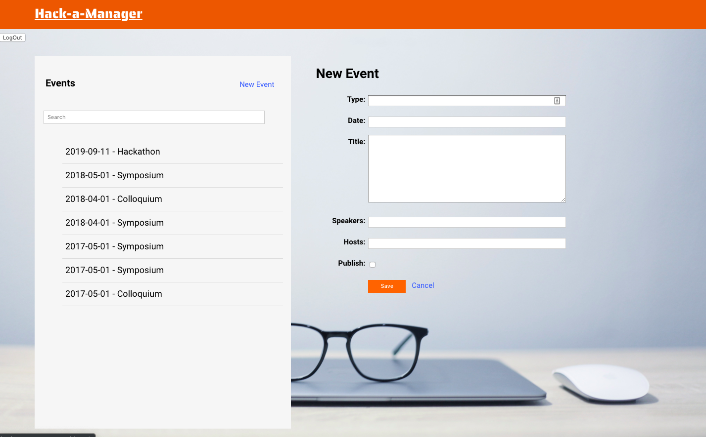

# Hack-a-Manager
http://hack-a-manager.surge.sh/

## Hack-a-Manager

### Description:

This is a full-stack CRUD app with authentication using React.js and Ruby on Rails. It allows users you to create, update and delete events that they would be interested in attending in their city. 

##### What you can do:
1. Become a user and create and manage as many events as you want!
2. Create, Read, Update and Delete all of your events using this web application

### Software Used:
- React.js, Ruby, Rails, JavaScript, HTML, CSS/Flexbox/Grid

### Screenshot: 

